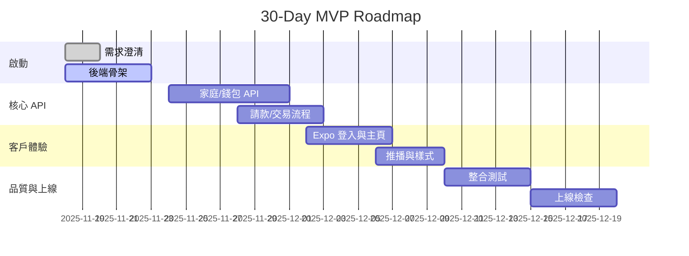

# Cacao 30 天衝刺計畫

此計畫協助在 30 個專注工作日內交付可上線的 Cacao MVP。所有任務以 `docs/product-guide.md` 與 `docs/sys-design.md` 為準繩，並要求每天在 `LOG.md` 記錄實際結果與風險。

---

## 使用指南
- 每日工作內容請以 **Focus / Key Steps / Done When** 紀錄，若某日無法完成請移至下一個可行日，並將原因寫入 `LOG.md`。
- 建議同時維持三條作業線：Go API、Expo 行動 App、測試／部署工具鏈。任何牽涉資料庫或設定變更必須同步更新 `configs/`、`migrations/` 或 `infra/`。
- 文件更新請立即反映在 `docs/product-guide.md`、`docs/sys-design.md` 或相關章節，避免產品與實作脫節。

---

## 每週主題與亮點
| 週次 | 主題 | 本週目標 / 亮點 |
| --- | --- | --- |
| 第 1 週 (Day 1-5) | 專案啟動 + 後端基礎 | 釐清需求、建立資料模型、完成登入 API 與健康檢查 |
| 第 2 週 (Day 6-12) | Allowance / Wallet 核心 API | 打通家庭、錢包、請款 CRUD，建立 migration 與測試骨架 |
| 第 3 週 (Day 13-19) | 行動 App 互動體驗 | Expo Router 巡覽、實作登入與主畫面、接白名單 API |
| 第 4 週 (Day 20-26) | 整合測試與部署流水線 | 建立 CI、EAS 設定、完成通知與作業排程原型 |
| 第 5 週 (Day 27-30) | 穩定化與上線準備 | 收斂 bug、執行 e2e、完成發佈 checklist |

### 進度追蹤 (Mermaid)

> 若某項任務完成，請於 `gantt` 區段將標籤改為 `done` 並更新起訖日期，確保每週檢視會議可快速得知完成率。

---

## 每日行程

### Day 1 (2025/11/18) — 啟動與現況盤點
- **Focus**：同步產品範圍與技術假設。
- **Key Steps**：
  1. 閱讀現有 `docs/*.md` 與 `rules.md`，確認語言與輸出規範。
  2. 建立 `LOG.md` 條目、記錄主要風險與優先度。
  3. 盤點現有 Go/Expo 版本與 VS Code 設定，列出缺少的工具。
- **Done When**：風險列表完成且團隊共識同步於 `LOG.md`。

### Day 2 (2025/11/19) — 需求拆解與資料契約
- **Focus**：完成 Domain Canvas 與資料模型草稿。
- **Key Steps**：
  1. 將 Giver/Baby 旅程拆解成 API 需求，寫入 `docs/product-guide.md`。
  2. 產出主要資料表（families、wallets、allowances、requests、transactions）欄位說明。
  3. 在 `migrations/` 建立初版 SQL，尚未套用只存草稿。
- **Done When**：資料模型草圖與 API 列表都同步到 `docs/sys-design.md`。

### Day 3 (2025/11/20) — 環境設定與 Config
- **Focus**：讓 server 可以依環境變數啟動。
- **Key Steps**：
  1. 強化 `server/internal/platform/config`，支援 DB、CORS、Session Secret。
  2. 撰寫 `.env.example` 與 `configs/app.dev.yaml` 範本。
  3. 更新 README 的 Environment 章節，提醒如何設環境變數。
- **Done When**：`go run ./server/cmd/api` 能讀取新變數並記錄 log。

### Day 4 (2025/11/21) — 登入流程
- **Focus**：完成 `POST /api/v1/auth/login` 與 mobile 對接。
- **Key Steps**：
  1. 在 `internal/domain/auth` 加入密碼雜湊與 session token 產生。
  2. 新增 `internal/api/auth` validator，回傳統一錯誤格式。
  3. Expo App 建立 `AuthProvider` 與登入頁，串接 API。
- **Done When**：使用預設帳密 `amanda/1234` 可於 App 取得 token 並看到 Dashboard。

### Day 5 (2025/11/22) — 週檢視 #1
- **Focus**：評估啟動週輸出與追蹤風險。
- **Key Steps**：
  1. 走查 README、`docs/*.md`、`LOG.md`，更新任何變動。
  2. 對 server、mobile 執行 `go test ./...` 與 `npm run lint`，記錄問題。
  3. 規劃下週優先順序，標示依賴（DB、SDK、UI）。
- **Done When**：週檢視區塊寫入 `LOG.md`，並在本檔案更新進度條狀態。

### Day 6 (2025/11/23) — Families / Members 模組
- **Focus**：建立家庭與成員 CRUD。
- **Key Steps**：
  1. 定義 `internal/domain/families` use case 與 repository 介面。
  2. 寫 `internal/platform/router` route group `/api/v1/families`。
  3. 產出對應 migration，並寫最小的 handler 測試。
- **Done When**：可新增/查詢家庭並在 DB 留紀錄，Swagger 草稿同步。

### Day 7 (2025/11/24) — Wallets 模組
- **Focus**：串錢包、餘額維護與事件。
- **Key Steps**：
  1. 設計 `wallets` 表的唯一約束與預設幣別。
  2. 新增 `POST /wallets`、`GET /wallets/:id` API。
  3. 撰寫簡易餘額檢查（不可為負），寫入單元測試。
- **Done When**：CI 可跑 `go test ./internal/domain/wallets` 且通過。

### Day 8 (2025/11/25) — Allowance 排程邏輯
- **Focus**：建立 allowance 模型與排程設定。
- **Key Steps**：
  1. 定義週期、金額、目標錢包欄位與驗證規則。
  2. 在 `internal/jobs` 寫入初版 scheduler（暫以記憶體運作）。
  3. 更新 `docs/sys-design.md` 的 Jobs 章節。
- **Done When**：可在 local 觸發 job，看到排程 log。

### Day 9 (2025/11/26) — 請款 Request API
- **Focus**：Baby 上傳憑證與金額。
- **Key Steps**：
  1. 設計 `requests` 表並加入狀態機（pending/approved/declined）。
  2. 新增 `POST /requests` + `GET /families/:id/requests`。
  3. 產生 OpenAPI 片段於 `shared/api-schema`。
- **Done When**：Postman 建立請款成功並可查詢記錄。

### Day 10 (2025/11/27) — 審核與交易流水
- **Focus**：錢包配合請款審核調整餘額。
- **Key Steps**：
  1. 新增 `transactions` 表紀錄 debit/credit。
  2. `PATCH /requests/:id/approve` 會寫入 transaction 與更新錢包餘額。
  3. 於 `docs/product-guide.md` 補上審核流程與邊界情境。
- **Done When**：同一請款不可重複核准，並有 compensating log。

### Day 11 (2025/11/28) — 通知與事件匯流排
- **Focus**：建立通知 service 以及可替換的傳送介面。
- **Key Steps**：
  1. 在 `internal/notifications` 抽象 notifier，實作 email/webhook stub。
  2. Allowance/Request 狀態改變時呼叫 notifier。
  3. 撰寫 `internal/platform/server` middleware 記錄 correlation id。
- **Done When**：核准請款可看到通知 log，並記錄在 `LOG.md`。

### Day 12 (2025/11/29) — 週檢視 #2
- **Focus**：確認核心 API 可被自動化測試覆蓋。
- **Key Steps**：
  1. 撰寫 `tests/api-e2e` 腳本（k6 或 go test + httpexpect）。
  2. 重新檢查 migrations 與 seed，確保可 idempotent。
  3. 在 `docs/sys-design.md` 標示 API 完成度與未決事項。
- **Done When**：E2E 腳本可跑通 happy path 並產生報告。

### Day 13 (2025/11/30) — Expo 導航與 Theme
- **Focus**：整理 `apps/mobile` 的路由與樣式系統。
- **Key Steps**：
  1. 定義 `theme` 模組（light/dark/high-contrast）。
  2. 更新 `app/(tabs)` 與 `features/*` 使用 ThemeProvider。
  3. Document theme 選項於 `docs/product-guide.md` UI 章節。
- **Done When**：使用者可在設定頁切換主題並即時套用。

### Day 14 (2025/12/01) — 登入與 Session 體驗
- **Focus**：強化 App 登入流程與錯誤處理。
- **Key Steps**：
  1. 增加輸入驗證、錯誤提示、多語字串。
  2. 寫 `services/api.ts` 錯誤攔截與 token 儲存策略草稿。
  3. 更新 `docs/sys-design.md` 行動端章節。
- **Done When**：登入失敗有明確訊息、成功後可維持 session。

### Day 15 (2025/12/02) — Dashboard 資料綁定
- **Focus**：在 App 顯示真實 API 資料。
- **Key Steps**：
  1. 將 dashboard hooks 改為呼叫 `/families/:id/summary`。
  2. 為 requests tab 加入 skeleton loading 與錯誤狀態。
  3. 撰寫 UI 截圖並收錄於 `docs/product-guide.md`。
- **Done When**：App 展示真實餘額、請款、下一次 allowance 日期。

### Day 16 (2025/12/03) — Baby 端請款流程
- **Focus**：在 App 中提交請款與附件。
- **Key Steps**：
  1. 建立 `features/requests/create` 表單與圖片挑選。
  2. 串接 `POST /requests`，並處理 400 error。
  3. 設計基本附件上傳策略（先 placeholder，以後串 S3）。
- **Done When**：使用者可在模擬器建檔案並看到 pending 項目。

### Day 17 (2025/12/04) — 推播/通知 UX
- **Focus**：建立通知列表與靜態推播設定。
- **Key Steps**：
  1. 使用 Expo Notifications 建立 permission flow（stub）。
  2. Settings 頁加入推播 toggle 與說明文字。
  3. 於 `docs/sys-design.md` 記錄日後要串 FCM/APNs 的流程。
- **Done When**：App 可顯示通知列表並根據 toggle 決定是否顯示。

### Day 18 (2025/12/05) — 多語與可及性
- **Focus**：導入 i18n 與 High Contrast 體驗。
- **Key Steps**：
  1. 擴充 `i18n` 字串，支援至少 zh-TW / en-US。
  2. 整合 Theme + i18n 切換事件，測試高對比模式。
  3. 補上 QA checklist（顏色對比、動作區大小）。
- **Done When**：App 內所有文字都走 i18n，並可切換語言。

### Day 19 (2025/12/06) — 週檢視 #3
- **Focus**：行動體驗回顧與 bug triage。
- **Key Steps**：
  1. 實際走一次 Giver/Baby 旅程並錄影。
  2. 更新 `LOG.md`，標記需延後功能。
  3. 規劃下一週整合測試、CI、EAS 任務。
- **Done When**：回顧紀錄與影片連結貼在 `LOG.md`。

### Day 20 (2025/12/07) — GitHub Actions 流程
- **Focus**：建立 lint/test workflow。
- **Key Steps**：
  1. 在 `infra/github` 新增 `ci.yml`，跑 Go test + npm lint。
  2. 加入 caching（Go modules、pnpm / npm）。
  3. 於 README 新增 badge 與流程說明。
- **Done When**：PR 觸發 CI 並顯示成功結果。

### Day 21 (2025/12/08) — Docker Compose 本地體驗
- **Focus**：提供一鍵啟動 DB/minio/mailhog。
- **Key Steps**：
  1. 擴充 `infra/docker-compose`，加上 MySQL、Mailhog、MinIO。
  2. 撰寫 `make dev` 或 `task dev:stack` 指令。
  3. 更新 README「Running the stack」章節。
- **Done When**：`docker compose up` 可啟動所有依賴並記錄於 `LOG.md`。

### Day 22 (2025/12/09) — Allowance Job 實際排程
- **Focus**：將 in-memory job 改為以資料庫驅動。
- **Key Steps**：
  1. 在 DB 新增 `allowance_runs` log。
  2. Jobs 讀取排程表、撈符合條件的 allowance。
  3. 製作簡易 CLI 讓開發者可手動觸發某家庭的排程。
- **Done When**：`go run ./server/cmd/jobs --family=demo` 可產生交易。

### Day 23 (2025/12/10) — 監控與記錄
- **Focus**：導入基礎 observability。
- **Key Steps**：
  1. 在 `internal/platform/server` 加入 request log + trace id。
  2. 將關鍵指標（成功登入、請款核准）輸出到 StatsD/Prometheus stub。
  3. Document 監控需求於 `docs/sys-design.md`。
- **Done When**：本地可看到 JSON log 並在 README 補充查閱方式。

### Day 24 (2025/12/11) — 測試覆蓋率提升
- **Focus**：把 domain 層測試覆蓋提升到 70%。
- **Key Steps**：
  1. 對 wallets、allowances、requests 撰寫邊界測試。
  2. 在 CI 加入 coverage 報告（go test -coverprofile）。
  3. 彙整測試缺口於 `LOG.md`。
- **Done When**：`go test ./... -cover` 顯示 70% 以上。

### Day 25 (2025/12/12) — 週檢視 #4
- **Focus**：品質回顧與安全檢查。
- **Key Steps**：
  1. 走查錯誤處理、驗證、Rate limit 設計。
  2. 確認 secrets 管理方案（.env、GitHub Secrets）。
  3. 更新 `docs/sys-design.md` 安全章節與 pending list。
- **Done When**：安全審查結果與改善計畫寫入 `LOG.md`。

### Day 26 (2025/12/13) — EAS / 發佈流程
- **Focus**：準備 mobile build。
- **Key Steps**：
  1. 在 `apps/mobile/eas` 填寫 `eas.json`、說明證書需求。
  2. 撰寫 `npm run dev:mobile` + `eas build --profile preview` 教學。
  3. 將流程寫進 README 與 `docs/product-guide.md` 推播章節。
- **Done When**：EAS preview build 成功且連結記錄於 `LOG.md`。

### Day 27 (2025/12/14) — 整合測試 Run 1
- **Focus**：跑通從登入到請款核准的 e2e。
- **Key Steps**：
  1. 啟動 docker compose + server + mobile 指令，列於 `LOG.md`。
  2. 以 Postman / k6 / Detox 走完整流程，記錄結果。
  3. 建立 issue list 追蹤 bug。
- **Done When**：出現的問題都有對應 issue，並在 `LOG.md` 附錄測試截圖或影片。

### Day 28 (2025/12/15) — 整合測試 Run 2 + 性能
- **Focus**：補足性能/併發測試。
- **Key Steps**：
  1. 以 k6 模擬 50 rps 登入/請款，調整 DB index。
  2. 分析結果並寫入 `docs/sys-design.md` 性能章節。
  3. 修復上一輪 e2e 的阻塞 bug。
- **Done When**：性能測試報告完成，瓶頸與 action items 明確。

### Day 29 (2025/12/16) — 上線清單
- **Focus**：整理 GA、監控、營運需求。
- **Key Steps**：
  1. 撰寫 `docs/product-guide.md` 的上線 checklist（支援、匯款流程）。
  2. 驗證資料備份、災難復原劇本。
  3. 完成 release note 草稿。
- **Done When**：所有上線條件皆列在 checklist 並指派負責人。

### Day 30 (2025/12/17) — 決策會與收尾
- **Focus**：彙整成果 & 下一步建議。
- **Key Steps**：
  1. 準備 demo（API + App）並於會議演練。
  2. 更新 `docs/sys-design.md` 狀態表，標註已完成/未完成項目。
  3. 將後續需求與技術債整理成 issue backlog。
- **Done When**：決策會議通過，並有明確的 next sprint 方向。

---

## 指令速查
| 類別 | 指令 | 說明 |
| --- | --- | --- |
| Go 測試 | `cd server && go test ./...` | 執行所有 server 單元測試 |
| Go 執行 | `cd server && go run ./cmd/api` | 啟動 REST API |
| Jobs | `cd server && go run ./cmd/jobs` | 啟動排程/worker |
| Mobile 開發 | `npm run dev:mobile` | 啟動 Expo 開發伺服器 |
| Mobile 檢查 | `npm --prefix apps/mobile run lint` | 執行 Expo lint |
| Mobile 型別 | `npm --prefix apps/mobile run typecheck` | TypeScript 型別檢查 |
| Docker | `docker compose -f infra/docker-compose/docker-compose.yml up` | 啟動本地依賴 |
| CI 本地模擬 | `task ci`（或在 `tools/Taskfile.yml` 定義） | 重現 GitHub Actions 階段 |

請每日至少更新一次 `LOG.md`，並在週檢視（Day 5/12/19/25）同步此檔案的進度條與最新命令。
